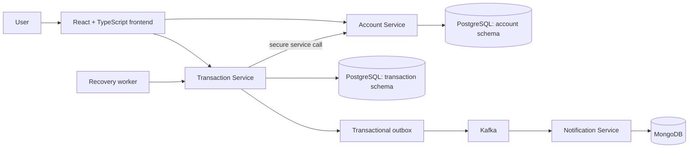

# FinLedger — Reliable Banking Transfer Platform

[](https://youtu.be/zDgYmhZ92UI)

**[Watch the project demo on YouTube](https://youtu.be/zDgYmhZ92UI)**

FinLedger is a full-stack banking project where users can create accounts, transfer money, view payment history, and track payment status. It is designed around a practical banking problem: a payment must remain safe even when a network call, notification, or receiving service fails.

> This is a learning project that simulates bank and UPI-style payment behaviour. It is not connected to NPCI, UPI, or any real bank.

## What the project can do

- Register and log in securely with JWT-based authentication.
- Create multiple accounts for the same user.
- Transfer money between account numbers.
- Show available balance and prevent spending the same funds twice.
- Create a payment reference for every transfer.
- Show payment history with `SETTLED`, `PENDING`, `REVERSED`, and `FAILED` states.
- Retry incomplete transfers and safely refund the sender when a transfer cannot complete.
- Publish completed-transfer events and store notifications asynchronously.

## Architecture



## How a transfer works

```text
1. User starts a transfer with an Idempotency-Key.
2. The sender's funds are placed on hold.
3. The sender is debited and the receiver is credited.
4. The transfer is marked SETTLED and a payment reference is returned.
5. A transfer event is saved to the outbox and later published to Kafka.
6. The notification service consumes the event and stores a notification.
```

If a service fails during the transfer, FinLedger keeps the transfer in a pending state and retries it. If the receiver cannot be credited after the sender was debited, the sender is refunded through a compensating transaction.

## Why these design choices?

| Problem | FinLedger approach |
|---|---|
| User clicks Send twice or a request is retried | An idempotency key returns the original transfer instead of debiting twice. |
| Two transfers try to use the same money | PostgreSQL row locking and payment holds protect the available balance. |
| Receiver-side service is slow or unavailable | A recovery worker retries incomplete transfers. |
| Sender was debited but receiver credit failed | A compensation step refunds the sender. |
| Kafka is temporarily unavailable | The event is stored in a PostgreSQL outbox first and published later. |
| Customer asks about a transfer | A UPI-style payment reference and status make the payment traceable. |

## Tech stack

- **Frontend:** React, TypeScript, Vite
- **Backend:** Java 21, Spring Boot, Spring Security, Spring Data JPA
- **Data:** PostgreSQL, MongoDB, Flyway migrations
- **Messaging:** Apache Kafka
- **Infrastructure:** Docker and Docker Compose
- **Security:** JWT authentication, account ownership checks, service-role tokens

## Run locally

### Requirements

- Docker Desktop or Docker Engine with Docker Compose
- Java 21 and Maven 3.9+ only if running services outside Docker

### Start the complete stack

```bash
git clone https://github.com/aun009/finLedger.git
cd finLedger/finledger
docker compose up --build
```

Services start at:

| Service | Address |
|---|---|
| Account API | `http://localhost:8081` |
| Transaction API | `http://localhost:8082` |
| Notification API | `http://localhost:8083` |
| Frontend development server | `http://localhost:5173` |

To start the frontend in a second terminal:

```bash
cd finLedger/frontend
npm install
npm run dev
```

## Testing

```bash
cd finLedger/finledger
mvn test

cd ../frontend
npm run build
```

## Current scope and next steps

FinLedger focuses on safe transfer processing, not real customer-money operations. A production version would additionally need an immutable double-entry ledger, audit logs, fraud controls, rate limiting, monitoring, full end-to-end tests, and real regulated payment-rail integration.

## Project demo

Watch the complete walkthrough here: **[FinLedger demo video](https://youtu.be/zDgYmhZ92UI)**.
